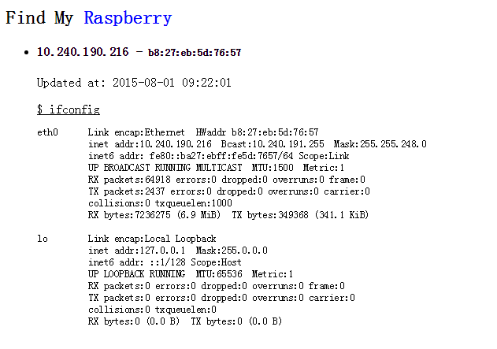

# Find My Raspberry

## Server

	pip install flask tinydb
	PORT=8858 python server.py

Your can use `hostname -i` to find your server IP in most times.

## Client(Run on your own raspberry)

	SERVER=http://<your-server-ip>:8858/api/findme python findme.py

It is recommend to add to crontab, open crontab with `crontab -e`

	* * * * * SERVER=http://10.246.13.180:8858/api/findme python findme.py

## Open your browser
Enter the server address, you will see your raspberry ip.

## LICENSE
[MIT](LICENSE)
